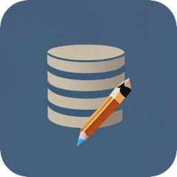

# CoreData Model Editor

<table border='0 px'>
<tr>
<td>
      

      
</td>
<td>
      
CoreData Model Editor is a macOS app that allows you to graphically edit a CoreData Model file (.xcdatamodeld files).

The good old CoreData graphical editor that was present in XCode disappeared when XCode 14 was released, only leaving the table based editor. This is a nice editor, but nothing is better than a diagram...

I wrote this app to help me with my CoreData models, and decided it could help others too.
      
</td>
</tr>
</table>

## V1.3 is now available and... it has undo management !!!

* V1.0 was able to graphically visualise the model.
* V1.1 was able to edit the model.
* V1.2 wrote generated model files that can be diffed to XCode outputs.
* V1.3 has validation of text fields, and an undo manager.

## Included features

* Graphical representation of entities, their attributes and their relationships.
* Edit the model as you wish, any entity, any attribute, relationships, create new model versions etc...
* Search the model for a string; all entity, attribute, and relationship names that include this string are found.
* Quickly see which entities are part of a configuration thanks to colours.

Full list of V1.3 new features:

- There is now a full Undo manager.
- Input fields are now validated to be OK for their usage (eg: Entity names start with an uppercase letter - or relationships can't be circular).
- .xccurrentversion file is now preserved between saves.
- Configurations' colors are now saved.
- Icon is of the right size.

## Features to come

* Managing Fetch Requests.
  => Will be the next big thing
* Show the diff between two model versions.
* Show the type of attributes, and the delete rule at each end of a relationship.
* Show model errors & warnings (e.g; missing type for an attribute).
* Manage individual .xcdatamodel files (today only .xcdatamodeld files are managed).
* Show model warnings or errors.

## Where to get the app

The app must be downloaded from the app store: https://apps.apple.com/us/app/coredata-model-editor/id6449733666

But wait ! It's not a free app !!!

Yes, that's true. The reason is that I would like to cover the developer annual fee to keep it on the App Store. Also, that keeps me motivated 😀.
**But it is very cheap**, and it is a pay-once-get-it-forever app. The price may go up as more features will come to the app, so don't hesitate to buy it right now, you'll get all the future features for free 😇.

## Where to get help, report a bug, or request a feature ?

You're at the right place. Just issue your report or feature in the relevant section.
